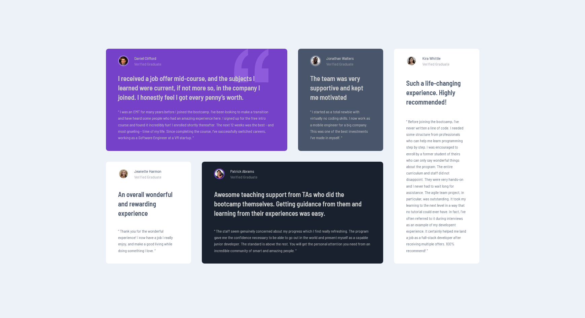
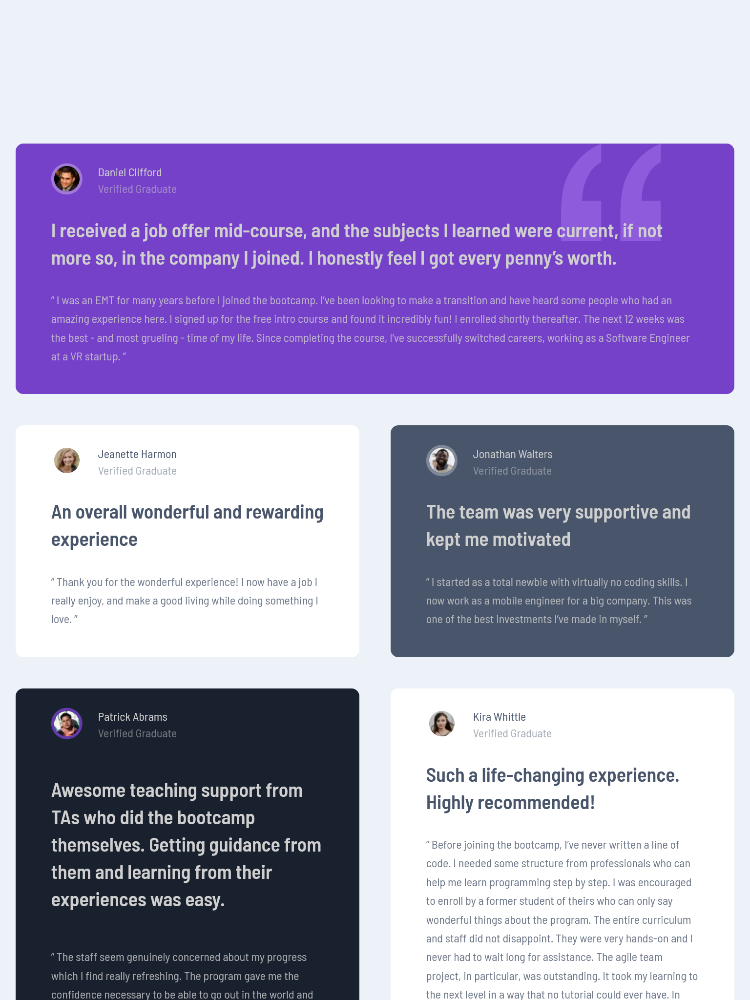
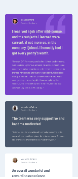

# Frontend Mentor - Testimonials grid section solution

This is a solution to the [Testimonials grid section challenge on Frontend Mentor](https://www.frontendmentor.io/challenges/testimonials-grid-section-Nnw6J7Un7). Frontend Mentor challenges help me improve me coding skills by building realistic projects. 

## Table of contents

- [Overview](#overview)
  - [The challenge](#the-challenge)
  - [Screenshot](#screenshot)
  - [Links](#links)
- [My process](#my-process)
  - [Built with](#built-with)
  - [What I learned](#what-i-learned)
  - [Continued development](#continued-development)
  - [Useful resources](#useful-resources)
- [Author](#author)

## Overview

### The challenge

Users should be able to:

- View the optimal layout for the site depending on their device's screen size

### Screenshot

desktop view

tablet view

mobile view

### Links

- Solution URL: [Solution URL here](https://your-solution-url.com)
- Live Site URL: [Live site URL here](https:/DarekRepos.github.io/Testimonials-grid-section/)

## My process

### Built with

- Semantic HTML5 markup
- CSS custom properties
- Flexbox
- CSS Grid
- Mobile-first workflow
- Astro
- SCSS

### What I learned

"I learned how to set up and deploy a basic site with Astro, create components, work with data fetching for collections of content, and integrate SCSS with the framework. The most tricky part was styling the component. 

### Continued development

I want to explore more techniques and do more project with Astro. 

### Useful resources

- MDN Web Docs - this help me mostly with html and javascript. 

- Sass - it help me with issues like mixin and deploying

- Lighthouse and Performance Insights Tool in Chrome - i use this tool to check performance and how my website behave on different screens (mobile, desktop, tablet)

- [Can I Use](https://caniuse.com) - this is excellent website that help me check if some css like text-rendering support all browsers

- [Astro doc](https://docs.astro.build/pl/getting-started/) - this is excellent website that help me check any features in Astro

## Author
- Website - [DarekRepos](https://github.com/DarekRepos)
- Frontend Mentor - [@DarekRepos](https://www.frontendmentor.io/profile/DarekRepos)
